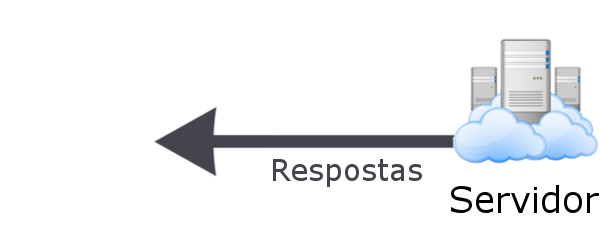

    

## API

A tradução para API é **Interface de Programação de Aplicações**, serve para integrar sistemas que através desse formato os dados se tornam mais seguros e você tem a total liberdade de interagir com diferentes linguagens, imagine que uma API seja um lego onde você consegue combinar para rapidamente construir um aplicativo ou aplicação corportativa, ou seja, se temos uma API desenvolvida ela pode ser facilmente consumida por qualquer aplicação.

Antigamente para cada novo sistema existia um novo banco, com as APIs, podemos consumir um único banco e várias aplicações ao mesmo tempo podem se conectar para recuperar os dados da API.

## O Facebook usa API

Podemos citar por exemplo o Facebook, quando um usuário se cadastra, automaticamente os dados é adicionado na API do facebook. Quando isso ocorre outros aplicativos podem utilizar isso a favor de forma a agilizar o cadastro dentro do app, por exemplo o Uber ao realizar o download ele pede para se cadastrar dando a opção de se cadastrar com o facebook, nesse momento o Uber se comunica diretamente com a API do facebook colaborando com a lógica de negócio da rede social.

Outras aplicações podemos citar como exemplo, aplicações que conecta com Google Maps, E-commerce, operadora de crédito, logar em sites com a rede social (Facebook) etc.

## As primeiras empresas a utilizar

Quando o assunto é API parece algo novo na tecnologia, mas na realidade ela existe desde 2000, inícou nos Estados Unidos, as empresas percebeu que teria chance de gerar negócios online e foi ai que começaram a usar API. A primeira API foi da SalesForce, que disponibiliza um serviço de automação de força de venda, eles identificam as necessidade dos clientes para compartilhar dados através de seus diferentes tipos de negócio.

Em seguida a Ebay um e-commerce gigante tendo como objetivo a busca pela facilidade de negócios como propósito central.

Depois de algum tempo (em 2006) o twitter focou sua API explorando capacidade de promover a comunicação e sharing de conteúdo. Na época muitos sites começaram a usar o twitter como forma de compartilhamento de páginas, antes mesmo do Facebook.

### Cliente - Servidor

    

O cliente faz uma requisição, essa requisição é um pedido feito para a API. A API recebe a requisição e consulta no servidor ou seja, considere essa requisição como um garçom falando ao servidor (que no caso é a cozinha) o que nosso cliente pediu.

Após o servidor receber essa requisição ele retorna alguma coisa, no caso uma mensagem se deu certo ou falhou.

Mas abaixo vamos entender melhor as requisições e o retorno do servidor.

### Requisições

    

No tópico anterior entedemos que uma requisição é feita pelo cliente para o nosso servidor, mas para que a requisição seja válida ela deve ter um formato específico.

Para as requisições existe um protocolo conhecido como **HTTP** (HyperText Transfer Protocol).

Quando você acessa um site que tem “http://” no começo, você está dizendo ao seu navegador para usar esse protocolo ao carregar o site.

A requisição deve ser seguida em quatro etapas:

* URL (Uniform Resource Locator);
* Método;
* Header;
* Body.

> Essas 4 partes serão explicar abaixo

#### Padrão de URL

A URL é o endereço que deve ser configurado a nossa API, ou seja, se acessarmos alfa.com.br/patrimonio/ quando chamamos na url patrimonio podemos configurar os métodos GET,POST, PUT e DELETE. Esse tipo de endereço é conhecido como endpoint, onde os nossos recursos estarão disponiveis.

#### Métodos

Os métodos são considerados os verbos que se comunica com o nosso recurso, são os GET, POST, DELETE e PUT.

#### Header

Através do header podemos detalhar como o cliente quer que a mensagem seja interpretada.

#### Body

Aqui é adicionado todos os parâmetros que tornam cada requisição diferente entre si. Por exemplo, se queremos acessar uma noticia a url ao invés de ser detalhada dessa maneira: noticia/entrevista-do-alfa com o body podemos definir apenas /noticia e cada tipo diferente é determinado pelas informações detalhadas no Body.

### Respostas

    

Agora que refinamos o nossa API recebeu nossa informação que queremos uma /noticia e nosso pedido foi transferido para o servidor, o servidor deve interpretar essa informação e retornar algo.

Esse retorno é semelhante a requisição composta apenas em três partes apenas:

* Código HTTP;
* Header;
* Body;

O Header e o Body, tem os mesmos conceitos da requisição (um passa certas diretrizes para analisar a mensagem e o outro dá os detalhes).

#### Código HTTP

Todos que já acessou a internet com certeza uma vez na vida pelo menos viu a mensagem de **erro 404**, provavelmente o mais famoso dos códigos HTTP. Cada uma dessas mensagens tem um significado, no caso do 404 a mensagem retornada é **recurso não encontrado**. Existe o código 200 OK, que retorna sempre que a requisição foi entendida e retornada com sucesso.

    

