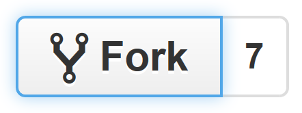
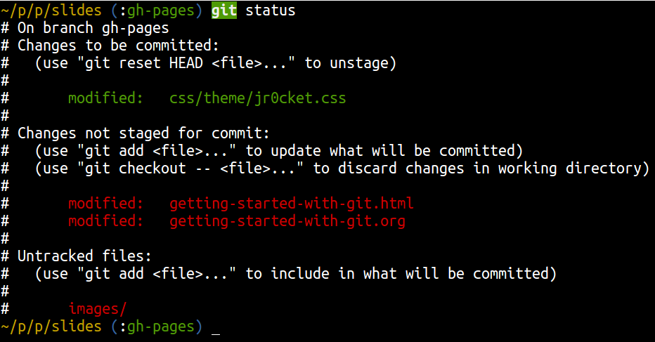
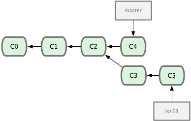

# Github

Introdução ao Git / Github.


# O que é?

"Git é um controle de versão para arquivos. Através do Git podemos desenvolver projetos e diversas pessoas podem contribuir simultaneamente no mesmo - editando e criando novos arquivos, e permitindo que os mesmos possam existir sem o risco de suas alterações serem sobrescritas."

**Fonte**: [Tudo que você queria saber sobre Git e GitHub, mas tinha vergonha de perguntar](https://tableless.com.br/tudo-que-voce-queria-saber-sobre-git-e-github-mas-tinha-vergonha-de-perguntar/)


# Download do Git

Para os usuários Windows, o Git pode ser baixado direto do site oficial, [clicando aqui](https://git-scm.com/)

# O que é Markdown
"Desenvolvido em 2004 por John Gruber e Aaron Swartz para simplificar a estruturação de um texto, o Markdown é um sistema de formatação aberto que torna a escrita e a leitura mais simples. Com uma codificação mínima, além de fácil, ele é visualmente mais "limpo" e pode ser convertido facilmente para HTML."

**Fonte**: [Você sabe o que é Markdown?](https://canaltech.com.br/o-que-e/programacao/Voce-sabe-o-que-e-Markdown/)

## Comandos básicos do Markdown

[Markdown Cheatsheet](https://github.com/adam-p/markdown-here/wiki/Markdown-Cheatsheet)

## Alguns projetos que estão no Github

1. jQuery
2. Ruby on Rails
3. NodeJs
4. Django
5. Bootstrap
6. Microsoft

## Fork



Para colaborar em um projeto mantido dentro do github (chamados de repositórios) precisamos criar uma cópia para nossa conta, isso é chamado de **Fork**. Usamos esta opção dentro de um repositório de terceiros, ao clicar, automáticamente o github cria uma cópia desse repositório para dentro do nosso perfil, localizado em nossos repositórios.

Em seguida podemos **clonar** nosso novo repositório que fizemos o Fork e realizar as modificações necessárias para o projeto.

## Clonando repositório

Para que possamos modificar a estrutura ou até mesmo implementar novas funcionalidade dentro de um projeto/repositório precisamos clonar o repositório locazalido no git para o computador. Para isso usamos o comando :

```
git clone URL
```

> Na **URL** deve ser inserido o link do repositório que pretende baixar.

## Pull Request no GITHUB

Sabemos que ao realizar um fork, estamos criando uma cópia do repositório de terceiros para dentro da nossa lista de repositório. O último passo e o mais importante é contribuir com a comunidade - imagine que suas alterações no repositório que realizou o fork arrume um bug que existia na biblioteca/framework, podemos com o **pull request** comparar o repositório original com a nossa cópia e sugerir essa alteração no repositório original. Feito esse procedimento o criador do repositório original receberá uma notificação de que houve uma sugestão de melhoria no código.


## Status do repositório

Para verificar se houve alteração no repositório ou se existe arquivos pendentes em commit, podemos utilizar o seguinte comando:

```
git status
```


## Adicionando modificações no stage

Sempre que um arquivo é modificado precisamos adicionar este arquivo em um **Stage**. Essa parte do versionamento é importante, pois podemos adicionar por etapas o nosso projeto. 

Por exemplo: foi modificado duas seções do projeto, a primeira do estoque de produtos e a segunda modificação foi feita na lista de clientes, com o comando _git add [nome do arquivo]_ podemos facilmente adicionar essas modificações em estágios separados ganhando um melhor controle das versões do projeto.

## Gravando arquivos no repositório

Os arquivos que foram colocados no **stage** ainda não foi adicionado no repositório, precisamos dizer para o git que queremos gravar nossas alterações no repositório. Para gravarmos definitivamente no repositorio precisamos digitar o seguinte comando:

```
git commit -m "Descreva esta versão aqui."
```

> Pronto, agora nossas modificações estão gravadas no repositório e prontas para serem subidas no github.

## Branch

Uma opção que é bem utilizada no dia a dia é a de criar uma seção separada do projeto, uma bifurcação, uma branch. Tal solução possibilita desenvolver separadamente cada uma das funcionalidades sem interferir no desenvolvimento de uma outra parte do projeto.

Por padrão quando é criado um repositório a primeira Branch se chama **master**. Essa branch é a nossa branch principal do projeto, é aconselhável realizar as modificações em branch's separadas para no fim juntarmos com a principal (se tudo estiver ok). Para criar uma branch nova digite:

```
git checkout -b [nome_da_branch]
```



## Listar Branch's

Para listar todas a branchs criadas em nosso versionamento *local* digite:

```
git branch
```

## Trocar de Branch

Para mudar de branch digite:

```
git checkout [nome_da_branch]
```

## Verificando o histórico do repositório

Para verificarmos as mudanças gravadas no repositório, ou seja, os commits, devemos utilizar o comando:

```
git log
```

## Push

O comando *push* adiciona todas as nossas modificações no **Stage** temos que **subir/push** essas alterações para nosso repositório github. Esse comando é o passo final para finalizar nossa versão da atual modificação do projeto. Temos que dizer nesse mesmo comando qual branch será adicionada esse stage.

```
git push origin [branch]
```

## pull

O comando **pull** é o inverso do comando **push**, por exemplo, suponhamos que existem três pessoas trabalhando no mesmo projeto: João, Lucas e Pedro. O João realizou algumas modificações dentro do projeto e deu um **push** para o repositório principal *(branch master)*, ele precisa falar para o Lucas e para o Pedro que subiu modificações e que eles devem dar um comando pull na branch master para baixar essas moficações em seus projetos. O comando pull é bem semelhante ao push, vejamos:

```
git pull origin master
```

## Merge

Se deseja trazer as alterações do master para uma das branch´s, devemos fazer uma operação chamada **merge**, que irá juntar um código no outro. Suponhamos que estejamos na branch **Dev**, e queremos trazer uma alteração do master para esta branch, precisamos realizar o seguinte comando:

```
git merge master
```

Pronto, nossa branch **Dev** vai carregar as alterações da master.

## Configurando o arquivo .gitignore

O *.gitignore* é importante para ignorarmos arquivos ou pastas que não são necessárias ter em nossos repositórios, por exemplo, quando estamos trabalhando com o composer e digitamos o **composer install** ele cria uma pasta chamada **vendor** (dependendo do framework) e essa pasta pode passar dos 100MB de tamanho. Nessa situação não precisamos dessa pasta, pois já temos o arquivo **composer.json** que ao digitar **composer update** ele ai ler as dependências que devem ser baixadas novamente para a pasta vendor.

Nesse tipo de situação dentro do arquivo **.gitignore** podemos colocar esta pasta para ser ignorada, apenas declarando **vendor/**.

> Geralmente pasta com imagens também são ignoradas.
